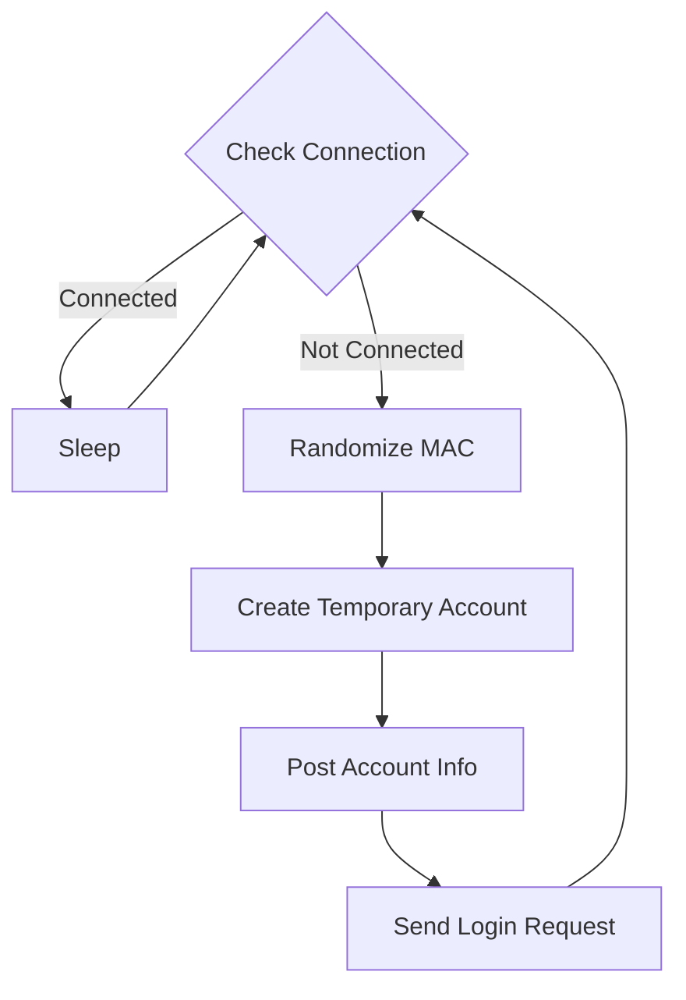

# Automatic WiFi Connection and Reconnection Script

This Python script is designed to automatically connect to a WiFi network named "Valence Briffaut" and periodically reconnect if the connection is lost. It randomizes the MAC address and creates a new temporary account on the WiFi network every time it reconnects.

## Requirements

- Python 3.x
- `requests` & `pythonping` library
- `macchanger` utility (installed on the system)
- `nmcli` utility (installed on the system)

## Setup

1. Install the required Python libraries:

```
pip install requests pythonping
sudo apt install macchanger network-manager
sudo pacman -S macchanger network-manager
```

2. Ensure that `macchanger` and `nmcli` utilities are installed on your system.

## Usage

1. Run the script:

```
sudo python script.py
```

The script will automatically connect to the "Valence Briffaut" WiFi network and monitor the connection. If the connection is lost, it will randomize the MAC address, create a new temporary account, and reconnect to the network.

## How it Works

1. The script defines a function `random_mac()` that disables the specified network interface (`wlp6s0`), changes the MAC address using `macchanger`, and then re-enables the interface and connects to the "Valence Briffaut" WiFi network.

2. The `get_token()` function fetches a token from  (`https://wireless.wifirst.net/index.txt`).

3. The `randomstring()` function generates a random string of specified length.

4. The `reconnect()` function performs the following steps:
   - Checks if the reconnection count (`COUNT`) is below a threshold (2). If it's above the threshold, it randomizes the MAC address.
   - Creates a new temporary account on the WiFi network with randomized email and password.
   - Posts the account information to the WiFi network's API endpoint.
   - Sends a login request to the WiFi network's login page.

5. The `check_connection()` function checks if the current connection is to the WiFi network by sending a ping to `1.1.1.1`.

6. The script enters a loop where it continuously checks the connection status using `check_connection()`. If the connection is lost, it calls `reconnect()` to reconnect to the WiFi network.


## Note

This script is intended for educational purposes only. Use it responsibly and in compliance with the terms of service and applicable laws.
